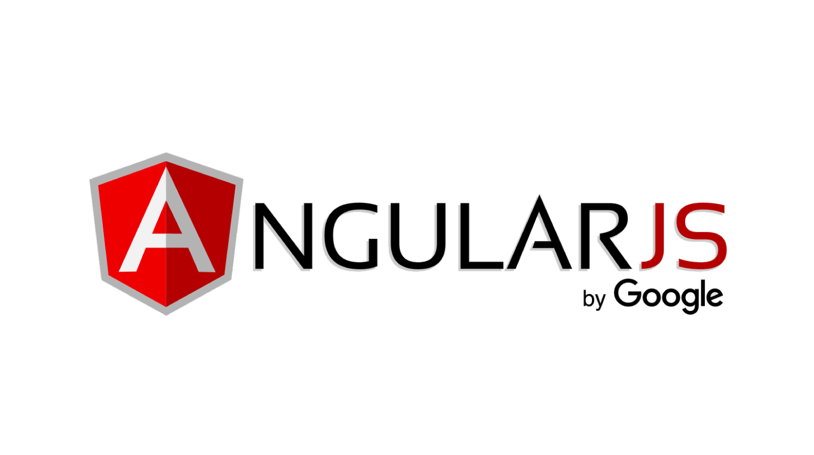
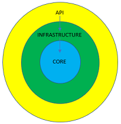

## .Net Core 3.0 C# Api example using Clean Architecture  

#### Project Update  

Added Angular 8 Web UI project to access .Net API.  

  

This solution consists of an Angular Web UI and a .Net Core 3.0 C# API including tests developed using Clean Architecture principles. The solution contains the WebUI, API, Infrastructure, Core, and Test projects. The Infrastructure project utilizes EntityFramework ORM with a Repository pattern for data access which is accomplished by a single, generic repository interface. Logging is implemented using Microsoft.Extensions.Logging interface with Serilog as the provider.

Swagger has also been implemented but in order to view the endpoints, a database needs to be created & connection strings in the API project/appsettings.json file will need to be modified to reflect your database environment. The SQL scripts to create the database tables are included in the *"docs"* folder.  

Clean Architecture in this example is obtained through architecture & the implementation of SOLID design principles including the following:  

* Separation of Concerns/Single Responsibility: UI (web user interface), API (REST endpoints), Infrastructure (Data Access), Core (Domain models & generic repository interface)
* Dependency Inversion Principle: All concrete class packages are referenced through abstractions (interfaces or abstract classes ) 
* Explicit Dependencies Principle/Dependency Injection: All dependencies requested via constructor  

The end result is a loosely coupled solution that is easily extensible, & highly resilient which each layer can be tested independently.  

### Project Structure  

* The WebUI.Angular project contains the Angular web user interface.
* The API project contains the REST endpoints, validation filters, logging &  files, AutoMapper maps, DTO models, & configuration.  
* The Infrastructure project contains the EntityFramework database context component & generic repository implementation.  
* The Core project contains the business domain entities, and generic repository inteface.  

  
Clean Architecture Diagram

From the diagram above, the api & infrastructure projects depend on the core project; all dependencies point inward to the core project. Inner projects define interfaces, outer projects implement the interfaces. None of the projects reference outward-positioned projects - inward references only. The Angular web project does not depend on other projects in this solution. It is a seperate project which hits the REST endpoints in the .Net Core Api project. The Api runs as a microservice. The WebUI.Angular project runs seperately from the Api.  

1.) The WebUI.Angular project (not pictured above; would be outer-most layer) calls the .Net Core Api project REST endpoints.   
2.) The API project has references to the Infrastructure and Core projects.  
3.) The Infrastructure project only references the Core project.  
4.) The Core project has no other project references.  

### Prerequisites

Angular (8) with Bootstrap 4.4.1  
AutoMapper (9.0.0)  
AutoMapper.Extensions.Microsoft.DependencyInjection (7.0.0)  
Microsoft.AspNetCore.App (3.0.1)  
Microsoft.NETCore.App(3.0.0)  
Microsoft.EntityFrameworkCore.SqlServer (3.0.1)  
Microsoft.EntityFrameworkCore.Tools (3.0.1)  
Microsoft.Extensions.Logging (3.1.0)  
Newtonsoft.Json (12.0.3)  
Serilog.AspNetCore (3.2.0)  
Serilog.Enrichers.Environment (2.1.3)  
Serilog.Sinks.Async (1.4.0)  
Serilog.Sinks.RollingFile (3.3.0)  
Swashbuckle.AspNetCore (5.0.0-rc4)  
System.Configuration.ConfigurationManager (4.6.0)  
Microsoft.NET.Test.Sdk (16.2.0)  
xunit (2.4.0)  
xunit.runner.visualstudio (2.4.0)

### Installing & running API project locally  

1.) Clone or download the project  
2.) Open the solution in VisualStudio 2019  
3.) Build the solution  
4.) Run the CleanArchitecture.Api project  
5.) The Swagger API implementation can be veiwed at: *[host url:port]/swagger/*  
6.) The data produced from the API can be viewed at: *[host url:port]/api/categories* & *[host url:port]/api/products*

### Running the Angular project locally   

1.) After the API project is running locally, open the Visual Studio solution again in a new instance  
2.) Right-click on the *CleanArchitecture.WebUI.Angular >>> Debug >>> Start new instance* to run the Angular project & copy the [host url:port] from the browser window
3.) To enable CORS requests to the API project, copy the *[host url:port]* from the browser API into the CleanArchitecture.Api *appsettings.json* file, ex:  

*"CorsDomains": "https://localhost:44337",*  

Note: No trailing backslash!

4.) In the CleanArchitecture.WebUI.Angular project edit the *src/app/environments/environment.ts* file and change the apiUrl to reflect the *[host url:port]/api/* from step 9 above , ex:   

*export const environment = {
  production: false,
  apiUrl: 'http://localhost:5002/api/'
};*  

Note: Trailing backslash!  

5.) Right-click on the *CleanArchitecture.WebUI.Angular >>> Debug >>> Start new instance* to run the Angular project
6.) A browser window will open to the Angular UI

## Running the tests

To run all of the solution tests, from the top-level menu items click *Test >>> Run All Tests*

### Test Composition

There are two types of tests included in the solution. These tests use an in-memory database for tests. Here is the test breakdown:

1.) Integration Tests: Tests the implementations of the asynchronous data repositories.  
2.) Functional Tests: Tests the REST API controllers.  

## Built With

* VisualStudio 2019
* MSSQL Server 2017  

## Demo Link  

https://cleanarchitecturewebapp.azurewebsites.net/

## Disclaimer

This solution is provided as a simple implementation of clean architecture using .Net & Angular. It is not meant to be used in any environment other than a development environment for learning purposes. By downloading, cloning, or any other means of implementing this solution, you agree to indemnify the author of all liability resulting from the use of this code.

## Author

* **Skip Gregory** - https://github.com/sgregory32
